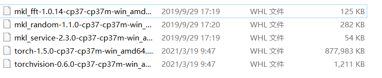
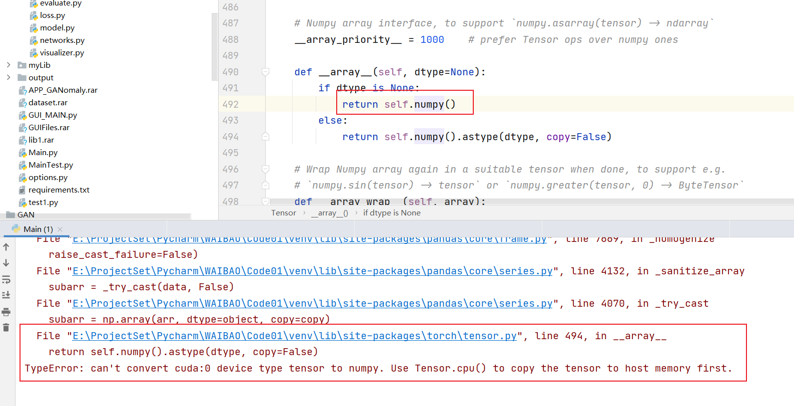
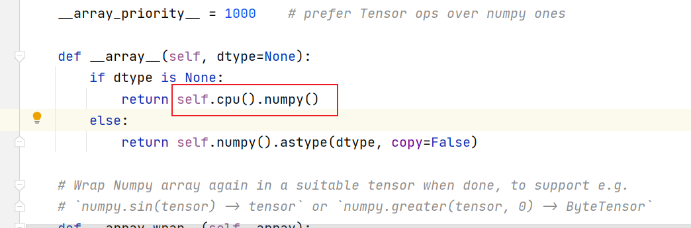
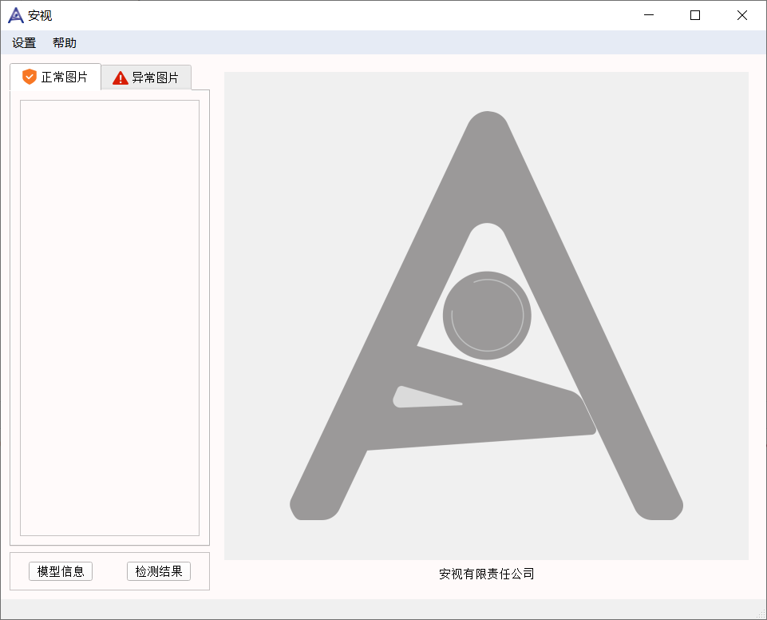
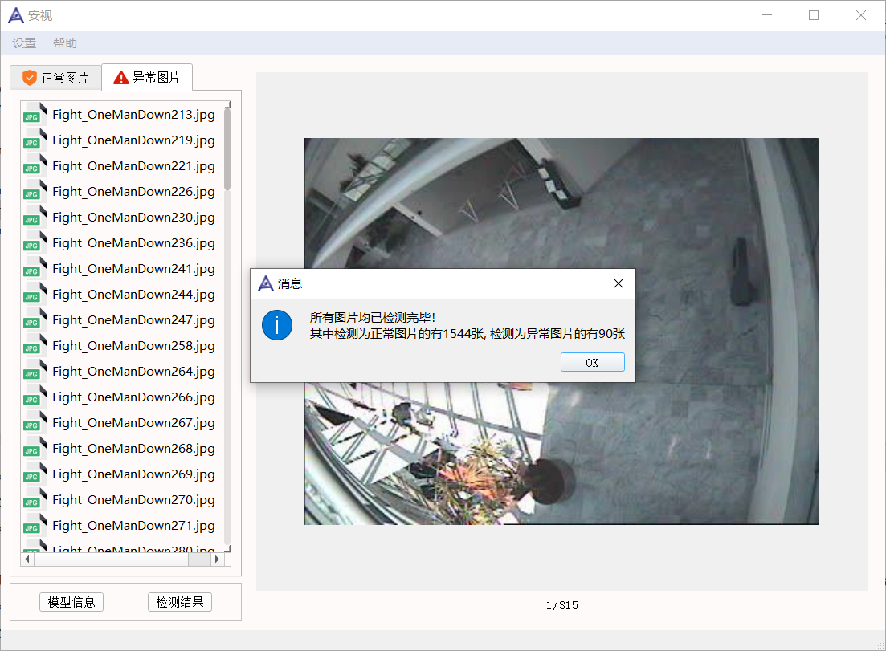
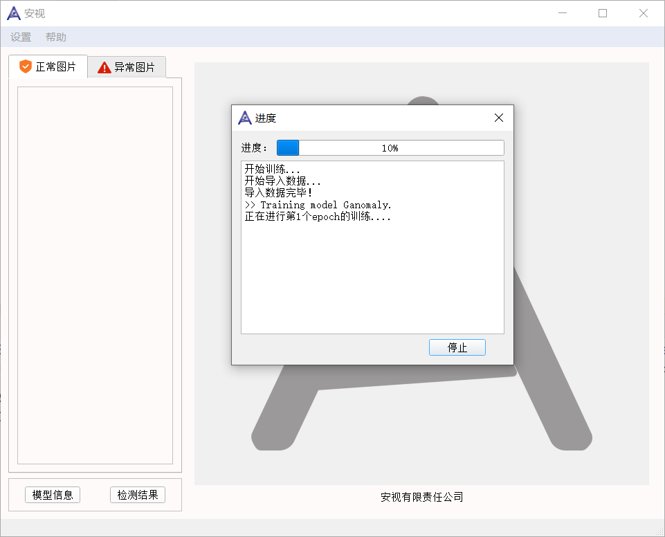

# 外包大赛项目demo

领域：异常检测

基于开源项目：https://github.com/samet-akcay/ganomaly

日期：2019年10月

## 安装

(1) 安装mkl相关库

(2) 安装pytorch

(3) 安装requirements相关库



**下载地址**: https://pan.baidu.com/s/1uSJKZOuwRaRjLfI_m3hwnw   【t7nj】

## 环境

+ os: win10
+ python 3.7.9

+ pytorch 1.5.0
+ cuda: 10.2

## 说明

### convert错误

训练模型时会报错，需要修改库代码

报错如下：



修改如下：



### 训练数据文件夹格式

```
.
├── train
│   └── 0
├── test
│   └── 0
│   └── 1
├── final_test
    └── 0
```

train和test中0为正常数据，1位异常数据

final_test中0中包含正常和异常数据，用于最终的测试

### 数据集来源

https://groups.inf.ed.ac.uk/vision/CAVIAR/CAVIARDATA1/

处理好的部分数据集下载地址：https://pan.baidu.com/s/1uSJKZOuwRaRjLfI_m3hwnw   【t7nj】

## 运行示例






